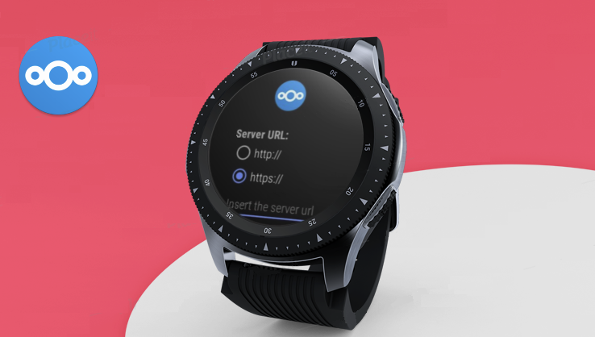
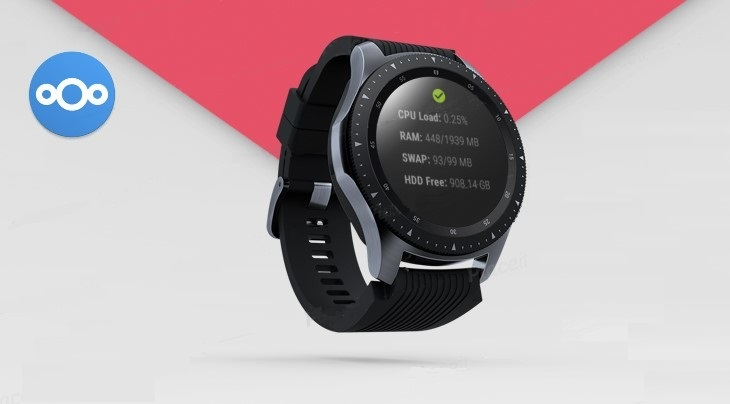

# NcMonitor - Nextcloud monitoring WearOS app :watch:
NcMonitor is a native [WearOS](https://wearos.google.com/#hands-free-help) application written in [Kotlin](https://kotlinlang.org/) that can be used to check the state of your [Nextcloud](https://nextcloud.com/) server. It is simple, fast and light. You have just to look up at your wrist to know if your NC instance is working properly or not.

 

## Displayed metrics :mag:
The goal of this application is to provide information about your NC instance:

- CPU usage (last-minute)
- RAM usage
- SWAP usage
- Disk free space

Data are retrived from [Nextcloud/serverinfo](https://github.com/nextcloud/serverinfo) and we will provide more metrics when available.

## How to use it :question:
The application requires basic authentication to communicate with the server and get back the metrics from [Nextcloud/serverinfo](https://github.com/nextcloud/serverinfo). During the first start it will require:

- select your HyperText Transfer Protocol (`http` or `https`)
- server URL (e.g. `myserver.com`)
- Nextcloud username
- Nextcloud password

### CPU Cores
To calculate the app's total CPU load percentage, it requires information about the number of CPU cores in your NC instance, which is set to a default value of 4. You can modify this setting through the configuration panel.

## Changelog
Changelog information are reported [here](https://github.com/DavideAG/NcMonitor/blob/master/CHANGELOG.md).

## Project status
The application has not been officially launched on the Google Play Store yet. To access and use the application, you can download the APK from the release section of this repository, or alternatively, you have the option to manually build the project. The initial release will soon be made available on the Google Play Store.

Please contact me if you have any problem with this installation process.

## License :scroll:
This application is licensed under the `AGPLv3`

## Contact
Any comment or idea about the project is appreciated, feel free to ping me at [davide@giorgiodavide.it](mailto:davide@giorgiodavide.it?subject=[GitHub]%20NcMonitor) or open an issue on GitHub.
